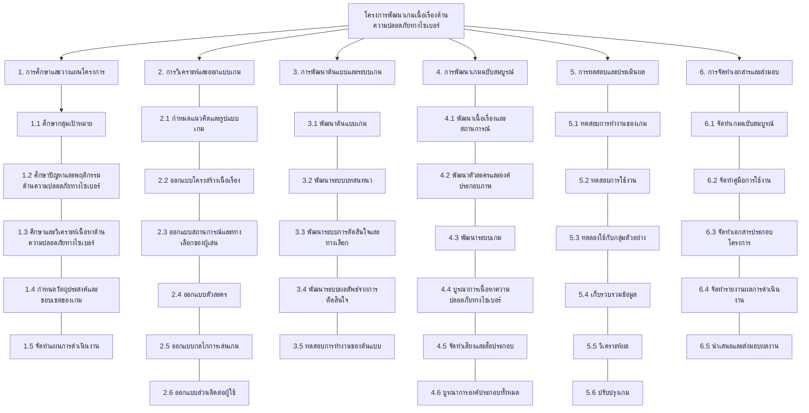

# Work Breakdown Structure (WBS)

```mermaid

flowchart TB
    A[โครงการพัฒนาเกมเนื้อเรื่องด้านความปลอดภัยทางไซเบอร์] --> B[1. การศึกษาและวางแผนโครงการ]
    A --> C[2. การวิเคราะห์และออกแบบเกม]
    A --> D[3. การพัฒนาต้นแบบและระบบเกม]
    A --> E[4. การพัฒนาเกมฉบับสมบูรณ์]
    A --> F[5. การทดสอบและประเมินผล]
    A --> G[6. การจัดทำเอกสารและส่งมอบ]

    B --> B1[1.1 ศึกษากลุ่มเป้าหมาย]
    B1 --- B2[1.2 ศึกษาปัญหาและพฤติกรรมด้านความปลอดภัยทางไซเบอร์]
    B2 --- B3[1.3 ศึกษาและวิเคราะห์เนื้อหาด้านความปลอดภัยทางไซเบอร์]
    B3 --- B4[1.4 กำหนดวัตถุประสงค์และขอบเขตของเกม]
    B4 --- B5[1.5 จัดทำแผนการดำเนินงาน]


    C --- C1[2.1 กำหนดแนวคิดและรูปแบบเกม]
    C1 --- C2[2.2 ออกแบบโครงสร้างเนื้อเรื่อง]
    C2 --- C3[2.3 ออกแบบสถานการณ์และทางเลือกของผู้เล่น]
    C3 --- C4[2.4 ออกแบบตัวละคร]
    C4 --- C5[2.5 ออกแบบกลไกการเล่นเกม]
    C5 --- C6[2.6 ออกแบบส่วนติดต่อผู้ใช้]


    D --- D1[3.1 พัฒนาต้นแบบเกม]
    D1 --- D2[3.2 พัฒนาระบบบทสนทนา]
    D2 --- D3[3.3 พัฒนาระบบการตัดสินใจและทางเลือก]
    D3 --- D4[3.4 พัฒนาระบบผลลัพธ์จากการตัดสินใจ]
    D4 --- D5[3.5 ทดสอบการทำงานของต้นแบบ]

    E --- E1[4.1 พัฒนาเนื้อเรื่องและสถานการณ์]
    E1 --- E2[4.2 พัฒนาตัวละครและองค์ประกอบภาพ]
    E2 --- E3[4.3 พัฒนาระบบเกม]
    E3 --- E4[4.4 บูรณาการเนื้อหาความปลอดภัยทางไซเบอร์]
    E4 --- E5[4.5 จัดทำเสียงและสื่อประกอบ]
    E5 --- E6[4.6 บูรณาการองค์ประกอบทั้งหมด]


    F --- F1[5.1 ทดสอบการทำงานของเกม]
    F1 ---F2[5.2 ทดสอบการใช้งาน]
    F2 ---F3[5.3 ทดลองใช้กับกลุ่มตัวอย่าง]
    F3 ---F4[5.4 เก็บรวบรวมข้อมูล]
    F4 ---F5[5.5 วิเคราะห์ผล]
    F5 ---F6[5.6 ปรับปรุงเกม]


    G --- G1[6.1 จัดทำเกมฉบับสมบูรณ์]
    G1 --- G2[6.2 จัดทำคู่มือการใช้งาน]
    G2 --- G3[6.3 จัดทำเอกสารประกอบโครงการ]
    G3 --- G4[6.4 จัดทำรายงานผลการดำเนินงาน]
    G4 --- G5[6.5 นำเสนอและส่งมอบผลงาน]
```